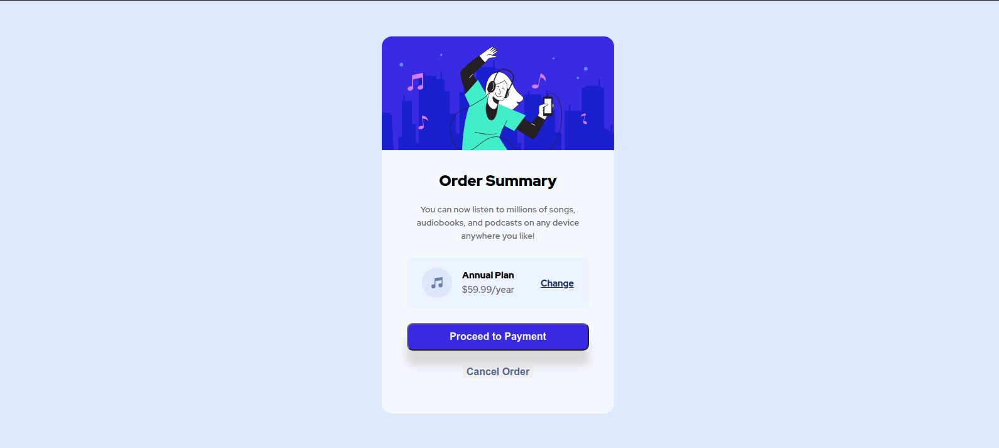
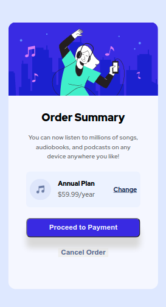

# Frontend Mentor - Order summary card solution

## Table of contents

- [Overview](#overview)
  - [The challenge](#the-challenge)
  - [Screenshot](#screenshot)
  - [Links](#links)
- [My process](#my-process)
  - [Built with](#built-with)
  - [What I learned](#what-i-learned)
  - [Continued development](#continued-development)

## Overview

This is my solution to the [Order summary card challenge on Frontend Mentor](https://www.frontendmentor.io/challenges/order-summary-component-QlPmajDUj).

### The challenge

Users should be able to:

1. See the Order Summary Card
2. See hover states for the following:
    - Change link
    - Proceed to Payment button
    - Cancel Order button

### Solution Screenshots

Desktop



Mobile



### Links

- Solution URL: [Order Summary](https://gianbarreto3.github.io/OrderSummary/)

## My process

For this challenge, I first wrote out my HTML.  Then I started working on the CSS starting from top-bottom of the card.  Styling the component is where I spent the majority of my time because I was having more trouble than I expected in order to complete this challenge.  I was having trouble making the component look decent in both mobile and desktop.  My main problem was that I had initially set the height of the card to 80%, and this did not look good on mobile screens.  I resolved this by giving the component a fixed height and tweaking the height of the card as well as the font-size of the body in order for the card to look decent on mobile.

### Built with

- HTML5
- CSS

### What I learned

This was the first time I really dealt with trying to make something responsive, so I learned a bit about flexbox, em, and the min function.  I used **em** in order to make the card content to grow and shrink depending on the font-size of the body. Below is some of the CSS that I wrote that utilizes flexbox and the min function.

```css
.flex-container {
    display: flex;
    justify-content: center;
    align-items: center;
}

card {
    width: min(90%, 35ch);
    ...
}
```

### Continued development

I plan on continuing practicing responsive design as well as CSS in general.
